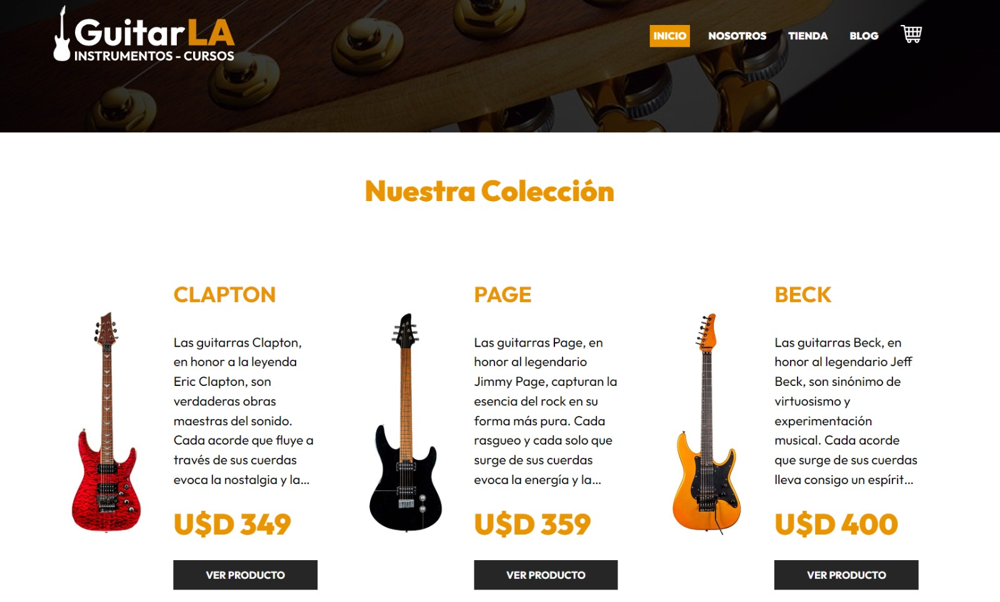
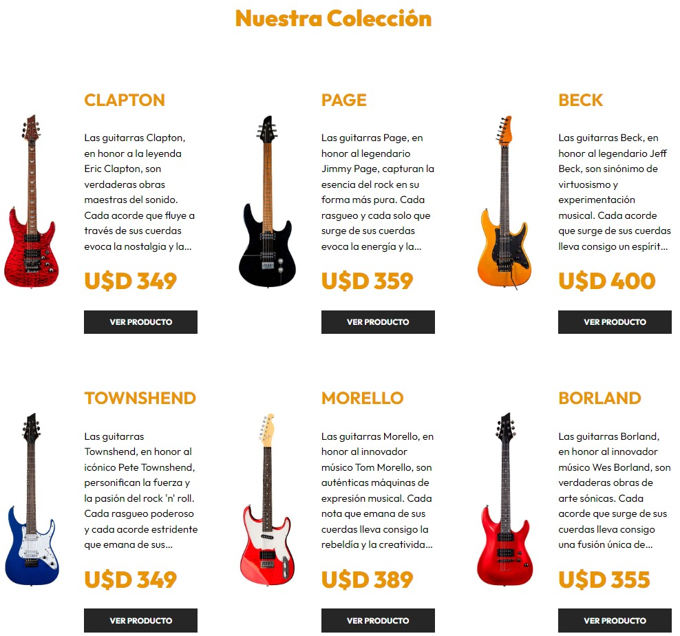
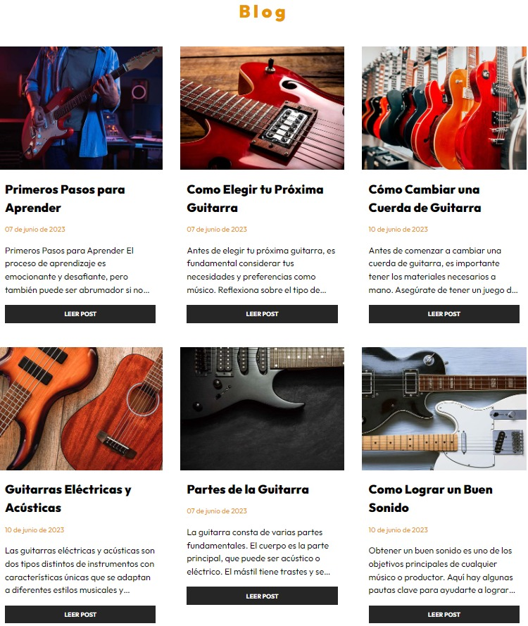
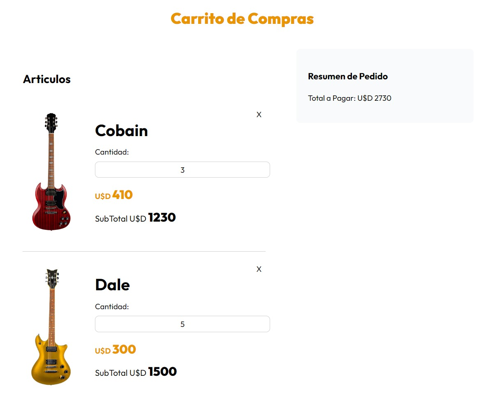
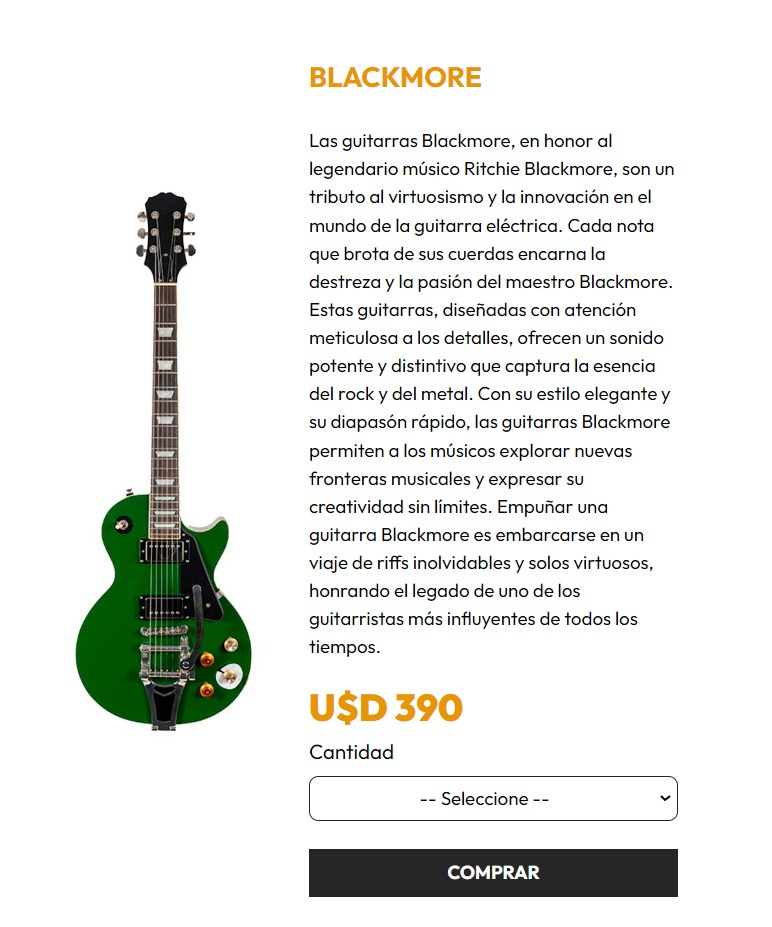
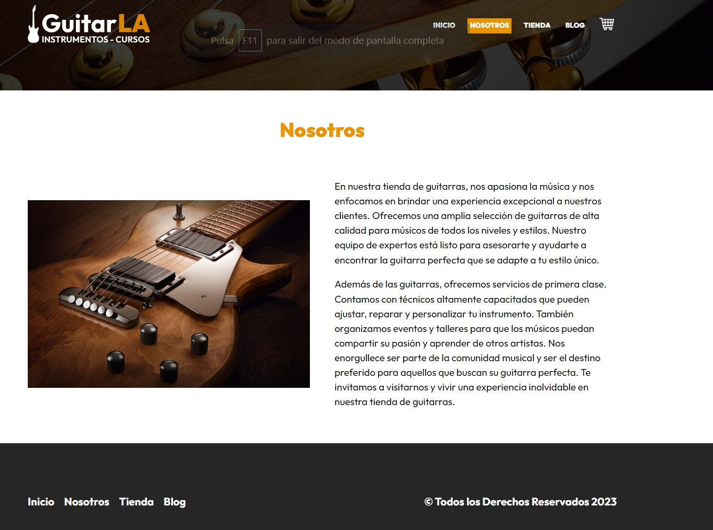

# GuitarLA - Tienda de Guitarras

GuitarLA es una aplicación de comercio electrónico que ofrece una amplia selección de guitarras para entusiastas de la música. Esta aplicación fue desarrollada como un prototipo/demostración para aprender y familiarizarse con las siguientes tecnologías:

- Base de datos de PostgreSQL utilizada en Render.
- Strapi como CMS (Sistema de Gestión de Contenido).
- Cloudinary para el almacenamiento de imágenes.
- Remix.run para el desarrollo y enrutamiento de la aplicación.

## Funcionalidades Principales

- Navegación intuitiva y amigable para los usuarios.
- Visualización de información detallada sobre cada guitarra disponible en la tienda.
- Página de "Nosotros" que brinda información sobre la empresa.
- Blog con artículos relacionados con el mundo de las guitarras.
- Carrito de compras para agregar y gestionar productos seleccionados.
- No se incluye una pasarela de pago, ya que el proyecto es un prototipo/demostración.

## Estructura del Proyecto

El proyecto GuitarLA está estructurado de la siguiente manera:

- **app**: Carpeta principal de la aplicación.
  - **components**: Componentes reutilizables utilizados en las diferentes páginas.
  - **models**: Archivos con funciones que obtienen información de Strapi.
  - **routes**: Archivos de enrutamiento para cada página.
  - **styles**: Archivos CSS para estilos personalizados.
  - **utils**: Archivos de utilidades, incluyendo un helper para el formateo de fechas.
  - **index.js**: Archivo principal de la aplicación.
  - **root.js**: Archivo de enrutamiento principal.

## Configuración de Imágenes con Cloudinary

Las imágenes de las guitarras se gestionan y almacenan utilizando Cloudinary. En Strapi, se ha configurado la integración con Cloudinary para permitir la subida directa de imágenes a través de la aplicación de Strapi.

## Capturas de Pantalla

A continuación, se muestran algunas capturas de pantalla de la aplicación:

1. Página de inicio:
   

2. Página de Tienda:
   

3. Página de Blog:
   

4. Carrito de Compras:
   

5. Comprar Guitarra:
   

## Gracias!!!

